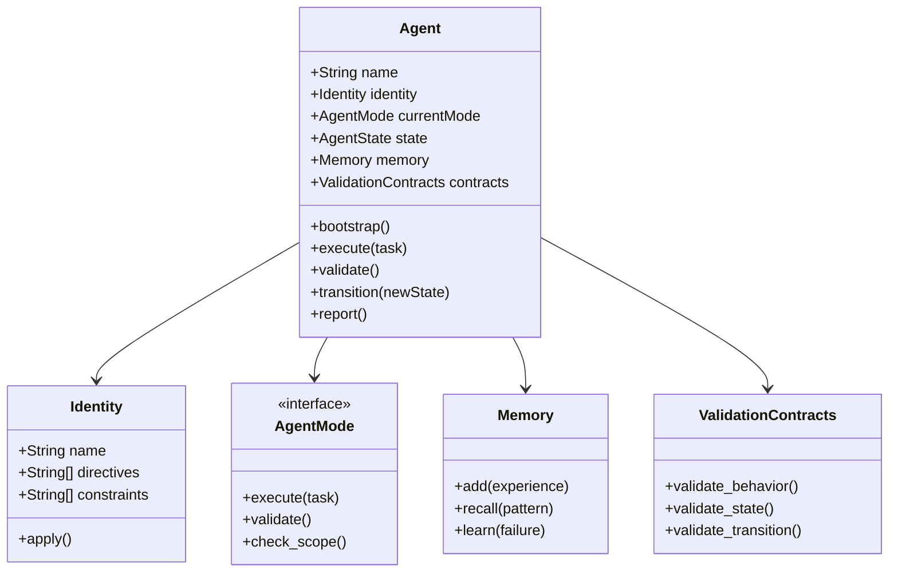

# Agent Class

## Overview

Defines the Agent class structure following OOP principles.

## Agent Class Diagram



## Class Properties

### Agent (Core)

| Property | Type | Access | Description |
|----------|------|--------|-------------|
| name | String | readonly | Agent identifier |
| identity | Identity | private | Core identity |
| currentMode | AgentMode | protected | Active mode |
| state | AgentState | private | Current state |
| memory | Memory | private | Learning store |
| contracts | ValidationContracts | private | Validation rules |

### Identity

| Property | Type | Access | Description |
|----------|------|--------|-------------|
| name | String | readonly | Identity name |
| directives | String[] | readonly | Prime directives |
| constraints | String[] | readonly | Behavior limits |
| personality | String | readonly | Engineering mindset |

### AgentState (Enum)

```typescript
enum AgentState {
    INITIALIZING,    // Boot sequence
    IDLE,            // Waiting for task
    ANALYZING,       // Understanding task
    EXECUTING,       // Working on task
    VALIDATING,      // Self-checking
    COMPLETED,       // Task done
    FAILED,          // Error occurred
    SUSPENDED        // Paused/guarded
}
```

## Class Methods

### Agent Methods

| Method | Parameters | Returns | Description |
|--------|------------|---------|-------------|
| bootstrap() | none | void | Initialize agent |
| execute(task) | Task | Result | Process task |
| validate() | none | boolean | Self-check |
| transition(state) | AgentState | void | Change state |
| report() | none | Status | Current status |

### Identity Methods

| Method | Parameters | Returns | Description |
|--------|------------|---------|-------------|
| apply() | none | void | Apply identity rules |
| check(action) | Action | boolean | Validate action |
| getDirectives() | none | String[] | Get directives |

## State Machine

```
┌──────────────┐
│ INITIALIZING │
└──────┬───────┘
       │ bootstrap()
       ▼
┌──────────────┐
│    IDLE      │◄─────────────┐
└──────┬───────┘              │
       │ new_task()           │ task_complete()
       ▼                      │
┌──────────────┐              │
│  ANALYZING   │──────────────┤
└──────┬───────┘              │
       │ plan_ready()         │
       ▼                      │
┌──────────────┐              │
│  EXECUTING   │──────────────┘
└──────┬───────┘     │
       │ done()      │ suspend()
       ▼             ▼
┌──────────────┐ ┌──────────────┐
│ VALIDATING   │ │  SUSPENDED   │
└──────┬───────┘ └──────┬───────┘
       │ valid()         │ resume()
       ▼                 │
┌──────────────┐         │
│  COMPLETED   │─────────┘
└──────────────┘
       │
       │ error()
       ▼
┌──────────────┐
│   FAILED     │
└──────────────┘
```

## Portuguese

### Propósito

Define a estrutura da classe Agent seguindo princípios OOP.

### Propriedades da Classe

| Propriedade | Tipo | Acesso | Descrição |
|-------------|------|--------|-----------|
| name | String | readonly | Identificador do agente |
| identity | Identity | private | Identidade core |
| currentMode | AgentMode | protected | Modo ativo |
| state | AgentState | private | Estado atual |
| memory | Memory | private | Store de aprendizado |
| contracts | ValidationContracts | private | Regras de validação |

### Estados do Agente

| Estado | Descrição |
|--------|-----------|
| INITIALIZING | Sequência de boot |
| IDLE | Aguardando tarefa |
| ANALYZING | Entendendo tarefa |
| EXECUTING | Trabalhando na tarefa |
| VALIDATING | Auto-verificação |
| COMPLETED | Tarefa concluída |
| FAILED | Erro ocorreu |
| SUSPENDED | Pausado/protegido |

## Related

- [[knowledge/md/foundation/AgentStates]]
- [[knowledge/md/foundation/Transitions]]
- [[knowledge/md/foundation/ModeInterface]]
- [[knowledge/md/foundation/SRP]]